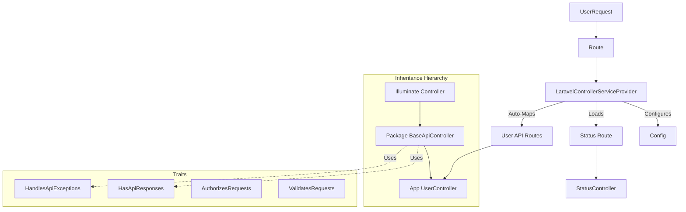

# Developer Guide

This guide is for contributors or developers who want to understand the internal architecture of the `laravel-controller` package.

## Code Structure

```
src/
├── config/
│   └── laravel-controller.php    # Default configuration
├── Http/
│   └── Controllers/
│       ├── BaseApiController.php # Abstract base class
│       └── StatusController.php  # Default status endpoint
├── Providers/
│   └── LaravelControllerServiceProvider.php # Main entry point
└── Traits/
    ├── HasApiResponses.php       # Response formatting logic
    └── HandlesApiExceptions.php  # Exception handling logic
```

## Architecture

The package follows a simple inheritance and trait-based architecture. The `ServiceProvider` binds configuration and routes, while the `BaseApiController` exposes functionality via traits.



## Request Lifecycle

1.  **Boot**: `LaravelControllerServiceProvider` runs.
    -   Publishes config.
    -   Checks `routes.enabled` config.
    -   Registers `/api/v1/status` if enabled.
    -   Scans host `routes/api/*.php` and maps them (e.g., `v1.php` -> `api/v1`).
2.  **Handling**: When a request hits `BaseApiController`:
    -   `HasApiResponses` provides methods like `respondWithItem`.
    -   It wraps data in the standardized JSON structure configured in `keys`.
3.  **Exceptions**: If an exception occurs (and you use the Exception Handler trait in your `Handler.php`), it is caught and formatted as a JSON error response.

## Testing

We use PHPUnit (Orchestra Testbench) for testing.

```bash
# Run all tests
composer test

# Run code analysis
composer analyse

# Run linting
composer lint
```

## Contribution workflow

1.  Fork the repository.
2.  Create a feature branch (`git checkout -b feature/amazing-feature`).
3.  Commit your changes (`git commit -m 'Add amazing feature'`).
4.  Run tests to ensure no regressions.
5.  Push to the branch (`git push origin feature/amazing-feature`).
6.  Open a Pull Request.
